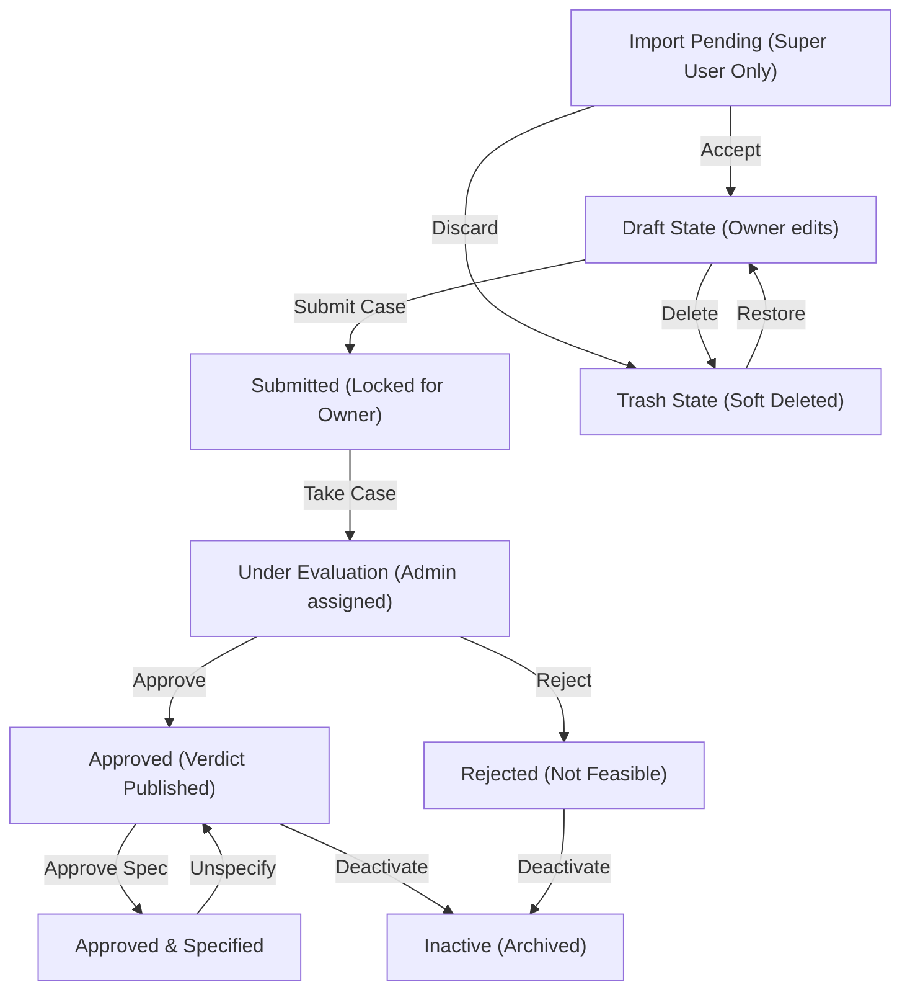

# SCAPE Bin-Picking Evaluator - User Manual

This manual is designed to help new users get started with the **SCAPE Bin-Picking Evaluator** and to provide experienced users with a quick lookup reference for project states, role modes, and dashboard controls.

---

## 1. Getting Started (For New Users)

The **SCAPE Bin-Picking Evaluator** is a smart data capture tool designed to collect bin-picking application parameters, evaluate feasibility, and recommend vision systems and grippers.

### Step 1: Authentication & Profile Setup
1. Open the application in your browser (e.g., [http://localhost:3000/](http://localhost:3000/)).
2. Log in using your **Google account** or sign up with an **Email & Password**.
3. Complete your **Profile Setup** by entering your name, company/organization, phone number, and primary role:
   * **End User / Slutkunde**: Manufacturing plants, factories, etc.
   * **Integrator / Forhandler**: Robotics integrators building the automation cell.
   * **Other**: General consulting or external partners.

### Step 2: Creating a Project
1. From the **Dashboard**, click the **New Project** button.
2. Complete the step-by-step questionnaire:
   * **Step 0 (Project & Cell Info)**: Enter the project name, number of parts, bin dimensions, preferred robot brand, and upload environmental photos of the cell location.
   * **Steps 1+ (Part Configuration)**: For each part, provide dimensions, material, target cycle times, expected temperatures, oil conditions, and upload part photos. If a 3D CAD model is available, upload it as a `.stl` file.
3. Use the **AI Assistant Chat** on the right sidebar if you need help auto-filling fields or have questions about bin-picking parameters.

### Step 3: Saving and Submitting
* **Save Draft**: Saves your current questionnaire entries. The project remains in the `Draft` state and can be modified at any time.
* **Submit Case**: Submits the project parameters to SCAPE for evaluation. Once submitted, the project is **Locked** for editing by the external user.

---

## 2. Roles and View Modes

The interface adjusts dynamically based on the active role of the logged-in user. SCAPE employees can toggle their active view in the top header:

### A. External Mode (Customer View)
* **Who can use it**: All users (Customers and SCAPE employees).
* **Interface**: Displays a clean customer dashboard. Users see only their own projects. They can edit drafts, upload media, request automated **AI Advice**, and view finalized reviews.

### B. Evaluator Mode (Scape Admin View)
* **Who can use it**: SCAPE Employees and authorized partners.
* **Interface**: Shows the **Administrative Dashboard** with access to all customer submissions. Evaluators can:
  * Assign submissions to themselves (**Take Case**).
  * Lock/unlock projects.
  * Generate an **AI Evaluator Draft** analysis.
  * Write the final technical report and decision verdict.
  * Approve specifications and toggle visibility of the verdict to the customer.

### C. Super User Mode
* **Who can use it**: Restricted exclusively to `rune.k.larsen@scapesolutions.eu`.
* **Interface**: Adds the **Super User Tools** dashboard toolbar. Grants access to bulk JSON data exports/imports, bulk staging acceptance, and administrator demo data seeds.

---

## 3. Project State Lifecycle

Below is a flowchart representing the lifecycles and transitions of projects within the system:

---

## 4. Project State Lookup Reference

Each project card displays its status badge on the dashboard. Use this table to understand the lifecycle states:

| State Badge | Editable By | Visible To | Description |
| :--- | :--- | :--- | :--- |
| **Draft** | Owner | Owner & Admins | The project is in preparation. Only the owner can edit it. Admins/Evaluators can view drafts but cannot edit answers, perform AI reviews, or write verdicts. |
| **Submitted** | Evaluator / Super User | Owner & Admins | Submitted to SCAPE for feasibility checks. The data is locked for the customer, and the case becomes open for evaluator action. |
| **Approved** | Evaluator / Super User | Owner & Admins | SCAPE has evaluated the project and approved it as technically feasible. The "Project Review from Scape Solutions" is automatically visible to the user. |
| **Rejected** | Evaluator / Super User | Owner & Admins | The project has been marked as not feasible or cancelled. The "Project Review from Scape Solutions" is automatically visible to the user. |
| **Specified** | Evaluator / Super User | Owner & Admins | An administrative sub-state indicating that the physical specifications have been verified and locked. |
| **Inactive** | Evaluator / Super User | Owner & Admins | Archived projects. Hidden from the dashboard unless the "Show Inactive" filter is toggled. |
| **Trash (Deleted)** | Evaluator / Super User | Owner & Admins | Staged in the trash bin. Can be restored by an admin or permanently deleted. |
| **Import Pending** | Super User | Super User Only | Staged imported records. They are invisible to all other users until accepted by a Super User. |

---

## 5. Control & Button Reference

### A. Dashboard Toolbar Buttons
* **Filters**: Expands or collapses search inputs (by project name, org, owner) and sort selections (date, organization, user).
* **New Project**: Starts an empty draft questionnaire.
* **Super User Tools Toolbar** (Super User mode only):
  * **Export Filtered (JSON)**: Package all currently visible cards, images, and CAD files as a single JSON file download.
  * **Import JSON**: Upload a JSON project file to stage them with `Import Pending` status.
  * **Accept All Staged**: Batch approves and activates all staged import cards.
  * **Generate Demo / Clean Demo**: Seeds 20 realistic demo projects or clears them from Firestore.

### B. Project Card Buttons
* **View Details / View Data**: Opens the project questionnaire and review tabs.
* **History**: Opens a popup listing the audit log changes (e.g., status changes, lock edits) with timestamps.
* **Delete / Restore**: Moves active projects to the trash, restores trashed projects, or triggers final database deletion.
* **Lock / Unlock** (Admin only): Manually locks or unlocks a project card.
* **Take Case** (Admin only): Assigns the case to the active Evaluator.
* **Approve** (Admin only): Approves the project feasibility.
* **Approve Spec / Unspecify** (Admin only): Toggles the verified "Specified" state badge.
* **Activate / Deactivate** (Admin only): Toggles active vs inactive status.
* **Export Dropdown**:
  * **Export as JSON**: Exports full project data (including image base64s) as a JSON file.
  * **Export as PDF**: Generates and downloads a branded PDF feasibility report (using jsPDF) including metadata, parts list table, project review text, and photos appendix.
* **Accept / Discard** (Staged cards only): Accepts a pending imported project to activate it, or discards it.

### C. Questionnaire & Review Buttons
* **Save Draft**: Saves the current questionnaire progress.
* **Submit Case**: Transmits the questionnaire details to SCAPE and locks editing.
* **Download All Media Files**: Sequential bulk download of all project CAD and image files.
* **Get Advice on Data** (External user review tab): Triggers Gemini AI to analyze the draft and provide constructive advice on missing fields or media uploads.
* **Generate Evaluator Draft** (Admin review tab): Prompts Gemini AI to draft a detailed technical feasibility review and recommends vision systems.
* **Submit Technical Verdict** (Admin review tab): Publishes the written technical report and feasibility decision to the database.
* **Toggle Verdict Visibility** (Admin review tab): Controls whether the customer can view the project review and recommendations on their review page.

---

## 6. Detailed Action Guide

### "Approve Spec" vs "Unspecify" in Detail
During evaluation of bin-picking configurations, verification of the project's specifications (such as CAD files, cycle times, bin dimensions, and surface properties) is essential before ordering hardware.
* **Approve Spec**: Used by an Evaluator to lock the verification process of physical parameters. Clicking it sets the project state `isFullySpecified` to `true`, displaying the green **Specified** badge on the project card.
* **Unspecify**: Used to revert this state. If requirements change or a mistake is discovered, clicking **Unspecify** returns `isFullySpecified` to `false`, removing the **Specified** badge so details can be edited/re-evaluated.

### Staging Imports ("Accept" vs "Discard")
When importing projects from external systems in JSON format:
1. They enter the database in a staged state (**Import Pending**) and are only visible in Super User mode.
2. The Super User can click **Accept** on the project card (or **Accept All Staged** in the toolbar) to move them into active status (making them visible to the assigned owners).
3. If the data is corrupted or unwanted, clicking **Discard** permanently clears the imported draft.

### Project Review Visibility for Users
* **Draft & Submitted State**: The "Project Review from Scape Solutions" report details and decisions are hidden from the external customer (unless manually published by an evaluator using "Publish Verdict to User").
* **Approved & Rejected State**: Once an evaluator approves or rejects a submission, the **Project Review from Scape Solutions** technical conclusions and recommendation texts are automatically and immediately visible to the customer under their **Review** tab.

---

## 7. Administrering af Adgang og Roller (For Administratorer)

For at tilføje eller fjerne brugere, ændre tilladte domæner eller tildele rettigheder (Evaluator/Super User) under drift, skal du redigere konfigurationsdokumentet i **Cloud Firestore**:

### Trin-for-trin Vejledning:
1. Gå til [Firebase Console](https://console.firebase.google.com/) og åbn dit projekt (**Scape Data Capture**).
2. Gå til **Firestore Database** i venstre sidepanel.
3. Find samlingen `config` og vælg dokumentet `access`.
4. Du kan nu tilføje eller fjerne elementer i de fire array-felter:
   * **`allowedDomains`**: Liste over domæner, der må oprette sig og logge ind i appen (f.eks. `scapesolutions.eu`, `scapesolutions.com`).
   * **`allowedEmails`**: Specifikke eksterne e-mailadresser, der må logge ind (f.eks. eksterne samarbejdspartnere uden for firmaet).
   * **`allowedEvaluators`**: E-mails på medarbejdere, der skal have adgang til **Evaluator Mode** (administrationspanelet, tildele cases, skrive technical reviews, osv.).
   * **`superusers`**: E-mails på medarbejdere med adgang til **Super User Mode** (bulk data import/export og demo-data generation).

### Vigtigt om ændringer:
* **Øjeblikkelig virkning:** Når du gemmer ændringer i Firestore, opdateres både serveren og browser-appen **med det samme (i realtid)** uden genstart eller udrulning.
* **Sikkerhed:** Kun godkendte medarbejdere (`isScapeEmployee`) har skrivetilladelse til `config/access` dokumentet i databasen for at forhindre uautoriserede ændringer. Standardbrugere har kun læserettigheder til validering under login.

