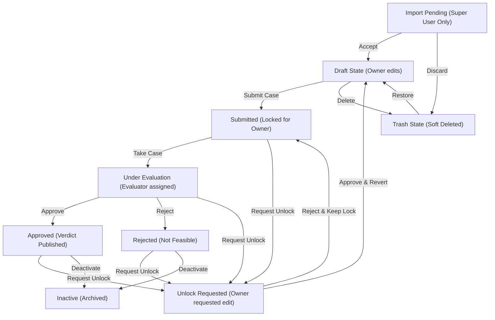

# SCAPE Bin-Picking Evaluator - User Manual

This manual is designed to help new users get started with the **SCAPE Bin-Picking Evaluator** and to provide experienced users with a quick lookup reference for project states, role modes, and dashboard controls.

---

## 1. Getting Started (For New Users)

The **SCAPE Bin-Picking Evaluator** is a smart data capture tool designed to collect bin-picking application parameters, evaluate feasibility, and recommend vision systems and grippers.

### Step 1: Authentication & Profile Setup
1. Open the application in your browser: [https://scape-bin-picker-projects.web.app/](https://scape-bin-picker-projects.web.app/) (or [http://localhost:8080/](http://localhost:8080/) for local testing).
2. Log in using your **Google account** or sign up with an **Email & Password**.
   * **iOS PWA Support:** If you have installed the app as a Progressive Web App (PWA) on iOS, Google Sign-In is supported natively inside standalone PWA mode using a custom cookie-based session bridge.
3. Complete your **Profile Setup** by entering your name, company/organization, phone number, and primary role:
   * **End User / Slutkunde**: Manufacturing plants, factories, etc.
   * **Integrator / Forhandler**: Robotics integrators building the automation cell.
   * **Other**: General consulting or external partners.

### Step 2: Creating a Project
1. From the **Dashboard**, click the **New Project** button.
2. Complete the step-by-step questionnaire:
   * **Step 0 (Project & Cell Info)**: Enter the project name, number of parts, bin dimensions, preferred robot brand, and upload environmental photos of the cell location.
   * **Steps 1+ (Part Configuration)**: For each part, provide dimensions, material, target cycle times, expected temperatures, oil conditions, and upload part photos. If a 3D CAD model is available, upload it as a `.stl` file.
   * **Foldable Part Sidebar**: When configuring projects with multiple parts, the left navigation bar organizes parts as collapsible folders. Click a part title (e.g. `Part #1: Shaft`) to expand/collapse its configuration steps (Dimensions, Characteristics, Visual Evidence) with smooth chevron animations.
   * **Extended Analysis Folder**: Two extra folders are provided below the parts sections:
     * **Business Case**: Enter shifts per day and labor cost savings to dynamically calculate a mock payback period (ROI calculation mockup).
     * **Additional Opportunities**: Add descriptive notes about other automation tasks in the cell and attach optional images for review.
3. Use the **AI Assistant Chat** on the right sidebar if you need help auto-filling fields or have questions about bin-picking parameters.

### Step 3: Saving and Submitting
* **Save Draft**: Saves your current questionnaire entries. The project remains in the `Draft` state and can be modified at any time.
* **Submit Case**: Submits the project parameters to SCAPE for evaluation. Once submitted, the project is **Locked** for editing by the external user.

---

## 2. Roles and View Modes

The interface adjusts dynamically based on the active role of the logged-in user. SCAPE employees can toggle their active view in the top header:

### A. User Mode (Customer View)
* **Who can use it**: All users (Customers and SCAPE employees).
* **Interface**: Displays a clean customer dashboard. Users see only their own projects. They can edit drafts, upload media, request automated **AI Advice**, and view finalized reviews.

### B. Evaluator Mode (Scape Evaluator View)
* **Who can use it**: SCAPE Employees and authorized partners.
* **Interface**: Shows the **Evaluator Dashboard** with access to all customer submissions. Evaluators can:
  * Assign submissions to themselves (**Take Case**).
  * Lock/unlock projects.
  * Generate an **AI Evaluator Draft** analysis.
  * Write the final technical report and decision verdict.
  * Approve specifications and toggle visibility of the verdict to the customer.

### C. Super User Mode
* **Who can use it**: Restricted exclusively to `rune.k.larsen@scapesolutions.eu` (configured dynamically in Firestore `config/access`).
* **Interface**: Adds the **Super User Tools** dashboard toolbar. Grants access to bulk JSON data exports/imports, bulk staging acceptance, and superuser demo data seeds.
* **AI System Prompts Editor**: Superusers can edit system prompt templates dynamically in the app (clicking **Edit AI Prompts**). It hosts three tabs:
  1. *Data Capture Advice* (for client feedback)
  2. *Technical Evaluation* (for evaluator drafts)
  3. *AI Chat Assistant* (for auto-fill helper)
* **LLM Image Toggles**: The prompt editor contains a toggle switch for each prompt tab: **"Include uploaded project & part images as visual attachments"**. Toggling this ON sends image attachments to Gemini (multimodal), while toggling it OFF strips them to save token usage and improve speed.

---

## 3. Project State Lifecycle

Below is a flowchart representing the lifecycles and transitions of projects within the system:

---

## 4. Project State Lookup Reference

Each project card displays its status badge on the dashboard. Use this table to understand the lifecycle states:

| **Draft** | User (Owner) | User & Evaluator | The project is in preparation and fully unlocked. Only the owner can edit it. Evaluators can view drafts but cannot edit answers, perform AI reviews, or write verdicts. |
| **Submitted** | Evaluator / Super User | User & Evaluator | Submitted to SCAPE for feasibility checks. The data is locked for the customer, and the case becomes open for evaluator action. |
| **Approved** | Evaluator / Super User | User & Evaluator | SCAPE has evaluated the project and approved it as technically feasible. The "Project Review from Scape Solutions" is automatically visible to the user. |
| **Rejected** | Evaluator / Super User | User & Evaluator | The project has been marked as not feasible or cancelled. The "Project Review from Scape Solutions" is automatically visible to the user. |
| **Unlock Requested** | Evaluator / Super User | User & Evaluator | The customer has requested edit permission for a locked project, providing a brief justification. Evaluators can review the request to approve (unlocks and reverts status to Draft) or reject it (keeps it locked). |
| **Inactive** | Evaluator / Super User | User & Evaluator | Archived projects. Hidden from the dashboard unless the "Show Inactive" filter is toggled. |
| **Trash (Deleted)** | Evaluator / Super User | User & Evaluator | Staged in the trash bin. Can be restored by an evaluator or permanently deleted. |
| **Import Pending** | Super User | Super User Only | Staged imported records. They are invisible to all other users until accepted by a Super User. |

---

## 5. Questionnaire Field Observations & Warnings

When the user requests **Data Capture Advice**, the system runs an automated evaluation:
1. **Extraction:** A secondary structured AI call extracts observations and maps them to specific questionnaire field IDs (e.g. `1.03` or `2.04`).
2. **Form Highlights:** In the questionnaire form, fields with concerns show inline colored warning badges (`⚠️` or `🔴`) next to their labels. Hovering or clicking these badges reveals a tooltip with the specific concern.
3. **Factual Verification:** This lets users quickly identify which input value needs correction or refinement.

---

## 6. Control & Button Reference

### A. Dashboard Toolbar Buttons
* **Filters**: Expands or collapses search inputs (by project name, org, owner) and sort selections (date, organization, user).
* **New Project**: Starts an empty draft questionnaire.
* **Super User Tools Toolbar** (Super User mode only):
  * **Export Filtered (JSON)**: Package all currently visible cards, images, and CAD files as a single JSON file download.
  * **Import JSON**: Upload a JSON project file to stage them with `Import Pending` status.
  * **Accept All Staged**: Batch approves and activates all staged import cards.
  * **Generate Demo / Clean Demo**: Seeds 20 realistic demo projects or clears them from Firestore.
  * **Edit AI Prompts**: Opens the Prompts Editor Modal to modify prompts and toggle image attachments dynamically.

### B. Project Card Buttons
* **View Details / View Data**: Opens the project questionnaire and review tabs.
* **History**: Opens a popup listing the audit log changes (e.g., status changes, lock edits) with timestamps.
* **Delete / Restore**: Moves active projects to the trash, restores trashed projects, or triggers final database deletion.
* **Lock / Unlock** (Evaluator only): Manually locks or unlocks a project card.
* **Take Case** (Evaluator only): Assigns the case to the active Evaluator.
* **Approve** (Evaluator only): Approves the project feasibility.
* **Activate / Deactivate** (Evaluator only): Toggles active vs inactive status.
* **Export Dropdown**:
  * **Export as JSON**: Exports full project data (including image base64s) as a JSON file.
  * **Export as PDF**: Generates and downloads a branded PDF feasibility report.

### C. Questionnaire & Review Buttons
* **Save Draft**: Saves the current questionnaire progress.
* **Submit Case**: Transmits the questionnaire details to SCAPE and locks editing.
* **Download All Media Files**: Sequential bulk download of all project CAD and image files.
* **Get Advice on Data** (User review tab): Triggers Gemini AI to analyze the draft and provide constructive advice on missing fields or media uploads.
* **Generate Evaluator Draft** (Evaluator review tab): Prompts Gemini AI to draft a detailed technical feasibility review and recommends vision systems.
* **Submit Technical Verdict** (Evaluator review tab): Publishes the written technical report and feasibility decision to the database.
* **Toggle Verdict Visibility** (Evaluator review tab): Controls whether the customer can view the project review and recommendations on their review page.
* **Apply Proposed Changes** (AI Assistant Panel): 
  * Displays a comparison layout showing your current data vs. the AI's proposal.
  * **Filtering:** The panel automatically hides unchanged fields, listing *only* values that are different.
  * **Visual Wrapping:** All proposed text is rendered inside textareas to prevent clipping and horizontal scrolling.

---

## 7. Detailed Action Guide

### Branded PDF Feasibility Report Layout
The exported PDF report is structured into clean, role-aware sections:
* **Section A (Factual Data):** Lists all questionnaire parameters in tables. If a field has an observation warning associated with it, it gets a colored marker `[!]` (critical) or `[⚠]` (warning) next to its value.
* **Section B (Data Capture Advice):** Displays a compact list of all flagged fields with their explanations, followed by the full narrative advice report.
* **Section C:** Contains uploaded part and cell photos as an appendix.
* **Section D (Review & Verdict):** Shows the most authoritative technical review text available:
  * For *Users (Customers)*, it displays the published **Project Review from Scape Solutions** verdict.
  * For *Evaluators*, if no verdict is published yet, it displays the dynamic **Evaluator AI Draft** text.
  * Fallbacks to general advice if no verdict or draft is generated.

---

## 8. Event Passcodes & Campaign Registration System

The **Campaign Passcode System** provides controlled, trackable public registration for trade shows, marketing campaigns, webinars, or open onboarding events (e.g. *Automatik 2026*).

### A. The "Entry Ticket" Model (Option A)
* **Registration Gate:** Event codes (e.g. `?event=Automatik26` or `?event=open`) act as a registration entry pass.
* **Once Registered, Always In:** When a user registers through an active campaign link, their account is permanently created in Firestore. Even if the campaign later expires or is paused, **existing registered users retain 100% full permanent access** to log in, view their projects, use the AI assistant, and review feasibility reports.
* **Pause / Expiration:** If an event pass code is expired or marked as Paused in the Superuser panel, new visitors attempting to register with that link are blocked with a clear notification (*"Access restricted: The campaign pass code is paused, expired, or invalid"*).

### B. Who Can Sign Up & Assigned Roles
1. **Public Campaign Visitors (via `?event=CodeName`):**
   * **Assigned Role:** **Standard User / Customer** (`role: 'enduser' | 'integrator'`).
   * **Capabilities:** Create bin-picking projects, chat with the AI assistant, upload 3D CAD (`.stl`) and photos, request automated AI advice, and view final Scape technical feasibility verdicts.
2. **Whitelisted Scape Evaluators & Employees:**
   * Accounts with `@scapesolutions.eu`, `@scapesolutions.com`, or configured in `config/access` `allowedEvaluators`.
   * **Assigned Role:** **Scape Evaluator & Staff**.
   * **Capabilities:** Access the full Evaluator Dashboard, take cases, lock/unlock projects, generate AI Evaluator Drafts, and publish technical reviews and verdicts.
3. **Superusers:**
   * Specific administrator emails configured in `config/access` `superusers`.
   * **Assigned Role:** **Super User Mode**.
   * **Capabilities:** Full access to **AI System Prompts Editor**, **Campaign Passcode Manager**, **User Activity Dashboard**, and bulk data export/import tools.

### C. Managing Campaigns (Superuser Tools)
1. Open the **Campaigns & Passcodes** tab inside the **Super User Tools** (`Edit AI Prompts` / `Campaign Tags`).
2. **Create a New Passcode:**
   * Enter the **Event Name** (e.g. `Automatik 2026`).
   * Enter the **Passcode Tag** (e.g. `Automatik26`).
   * Choose an **Expiration Date** (`YYYY-MM-DD`).
   * Toggle **Active (ON/OFF)**.
3. **Copy Shareable Link:** Click the copy button to get the ready-to-share URL:
   `https://scape-bin-picker-projects.web.app/?event=Automatik26`
4. **Campaign Tag Tracking:** When users sign up via this link, their profile is permanently tagged with `registeredViaCampaign: "Automatik26"`, which is visible on the **User Activity Dashboard**.

---

## 9. User Activity Dashboard & Account Controls

Superusers can inspect live user engagement, track active sessions, and manage test data in real time by clicking the **User Activity** button in the header:

* **Real-time Live Stream:** The dashboard streams updates in real time using Firestore snapshot listeners (no page reload needed).
* **Live Session Heartbeat:**
  * Displays a pulsating green indicator `🟢 Active Now` for any user with the tab open (2-minute heartbeat + tab visibility sync).
  * Relative activity time: `12m ago`, `3h ago`, `2d ago`, or `Never Active`.
* **Safe Suspend / Reactivate:**
  * Superusers can suspend an account with one click (blocks login and AI generation without deleting or orphaning their projects and data).
* **Test User Parameter (`🧪 Test Account`):**
  * Accounts created for testing (e.g. `+test@gmail.com`) are auto-tagged or can be toggled manually with the **`🧪 Test` / `Mark Test`** button.
  * **Test Filter Dropdown:** Filter between *All Accounts*, *Hide Test Accounts* (show only real production customers), and *Test Accounts Only*.

---

## 10. Voice Memo & Live Microphone Dictation (AI Assistant)

The **AI Chat Assistant** includes integrated live audio recording and multimodal voice processing:

### A. How to Use the Microphone
1. Open the **AI Assistant** panel in the questionnaire.
2. Click the **🎙️ Microphone icon** next to the chat input bar.
3. If prompted by your browser, allow microphone permissions.
4. Speak naturally in **Danish, English, German**, or your preferred language (e.g. *"Emnet er en stålbolt, længde 120mm, diameter 20mm, og vi skal plukke 400 emner i timen fra en standard gitterkasse"*).
5. A live recording timer (`🔴 00:15`) displays while recording.
6. Click the **Stop / Send** button.

### B. Speech-to-Parameters & Automatic Engineering Math
* The audio is recorded as high-quality audio (`audio/webm` or `audio/mp4`), compressed, and processed directly by Google Gemini's native multimodal audio model.
* **Automatic Calculations:** The AI extracts all parameters, converts speech to text, calculates part weight (`volume × density`) and cycle times (`3600 / 400 = 9.0s`), and generates an interactive **Proposed Changes** card for one-click form completion.

---

## 11. Mobile Visual Viewport & Keyboard UX

To provide a native-app feel on mobile devices and PWAs, the AI Assistant drawer has been engineered to handle soft keyboard adjustments smoothly:

### A. Dynamic Viewport Resizing
* When the virtual keyboard is shown or hidden, the drawer uses the **Visual Viewport API** (`window.visualViewport`) to measure the exact height of the screen *above* the keyboard.
* The drawer automatically shrinks to fit the remaining visible area, ensuring that the message log remains scrollable and the input bar stays visible directly above the keyboard.

### B. Auto-Scroll & Dismiss Gestures
* **Focus Auto-Scroll:** Tapping the text input field triggers an automatic scroll that pushes the most recent AI questions to the bottom of the visible log, keeping them in plain view.
* **Swipe-to-Dismiss:** Swiping or tapping on the chat message list (outside interactive buttons) automatically blurs the text area, collapsing the virtual keyboard.

