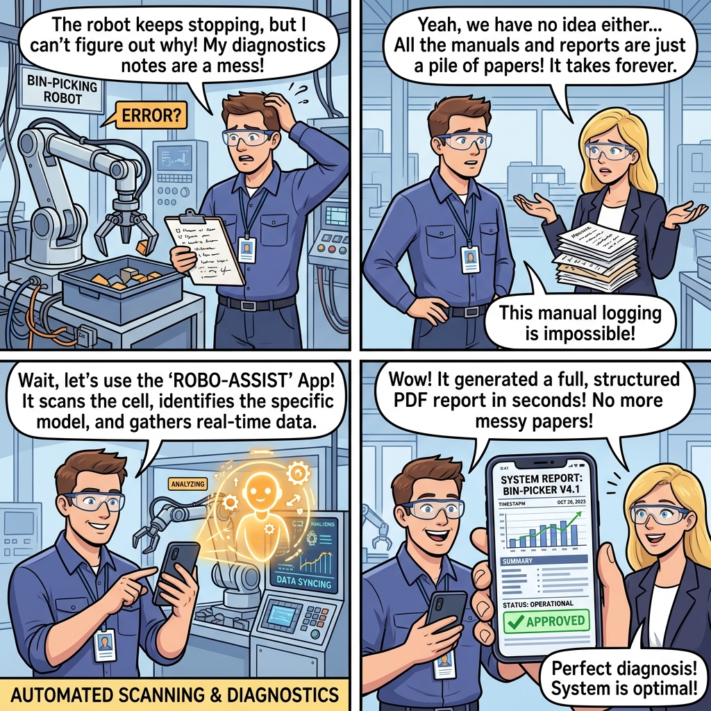

# SCAPE PICK-PILOT 🚀
### *Stop Guessing, Start Picking — The AI Copilot for Robotic Bin-Picking*

[](https://scape-pick-pilot.web.app/)
[](https://scape-pick-pilot.web.app/?event=Automatik26)

**Try it right now on your smartphone or laptop:**  
👉 **[https://scape-pick-pilot.web.app/?event=Automatik26](https://scape-pick-pilot.web.app/?event=Automatik26)** *(or scan the QR code on our booth screen)*

---

## 🎨 How It Works (In 60 Seconds)



```
┌─────────────────────────┐     ┌─────────────────────────┐     ┌─────────────────────────┐
│ 1. The Bottleneck       │ ──> │ 2. Guided Data Capture  │ ──> │ 3. Scape Evaluation     │
│ Slow emails, missing    │     │ Step-by-step guidance   │     │ Expert verification by  │
│ dimensions, guesswork.  │     │ with voice, CAD & photo.│     │ Scape application team. │
└─────────────────────────┘     └─────────────────────────┘     └─────────────────────────┘
```

---

## 💡 Why Automation Engineers & Integrators Love SCAPE PICK-PILOT

Evaluating robotic bin-picking cells used to take days of back-and-forth emails, lost CAD drawings, and missing cycle time definitions. **SCAPE PICK-PILOT replaces the guesswork with AI-driven engineering precision.**

### 🎙️ 1. Speak Naturally (Live Microphone Dictation)
* Tap the microphone and describe your application in **Danish, English, German**, or your preferred language:
  > *"We need to pick forged steel connecting rods weighing around 1.2 kg from a standard 1200x800x600 mm pallet. Our target production is 450 parts per hour using a Fanuc CRX robot."*
* PICK-PILOT converts your speech, performs the math, and structures the data instantly.

### 🧮 2. Automated Engineering Calculations
* **Part Weight Estimation:** Give the dimensions and material (e.g. *Stainless Steel*, *Aluminum*, *Cast Iron*), and the AI calculates the volume, density, and estimated part weight in kilograms.
* **Cycle Time Physics:** Tell it your production target (e.g. *450 parts/hour* or *3,000 parts/shift*), and the assistant calculates your exact takt time in seconds per part.

### 📐 3. Drag-and-Drop 3D CAD & Smartphone Photos
* Drop `.stl` 3D CAD files directly into your project.
* Snap photos of your parts, pallet boxes, and cell layout directly with your smartphone camera.
* Smart compression ensures rapid upload even on mobile 4G/5G connections.

### ⚡ 4. Instant "Project Information Advice"
* With one tap, Gemini AI audits your specifications against real-world bin-picking physics:
  * Detects surface reflectivity, glare, and optical challenges.
  * Identifies part entanglement or nesting risks.
  * Verifies gripper suction cups and magnetic payload limits.

### 📑 5. Scape Expert Evaluation & Verified PDF Report
* Submit directly to Scape robotics application engineers for expert feasibility review, verified cycle times, and an official branded **PDF Feasibility Report**.

---

## 📱 3-Minute Live Demo at the Booth

| Step | Action | What Happens |
| :--- | :--- | :--- |
| **1** | Open **[scape-pick-pilot.web.app](https://scape-pick-pilot.web.app/?event=Automatik26)** | Instant launch in any browser — no app store download required. |
| **2** | Tap **`+ Start with AI`** | Opens a structured engineering project workspace. |
| **3** | Tap the **🎙️ Microphone** | Dictate your part dimensions, bin size, and robot brand. |
| **4** | Click **`Apply Changes`** | Watch your form populate with verified engineering parameters. |
| **5** | Click **`⚡ AI Advice`** | Get an instant feasibility breakdown and recommended vision hardware. |

---

## 🏢 About SCAPE Solutions

**Scape Technologies** is the world leader in reliable robotic bin-picking with over 20 years of industrial experience across automotive, metalworking, and manufacturing plants worldwide.

* **Website:** [www.scapesolutions.com](https://www.scapesolutions.com)
* **Live App:** [https://scape-pick-pilot.web.app](https://scape-pick-pilot.web.app/?event=Automatik26)
* **Direct Contact:** `rune.k.larsen@scapesolutions.eu` / `sales@scapesolutions.eu`

